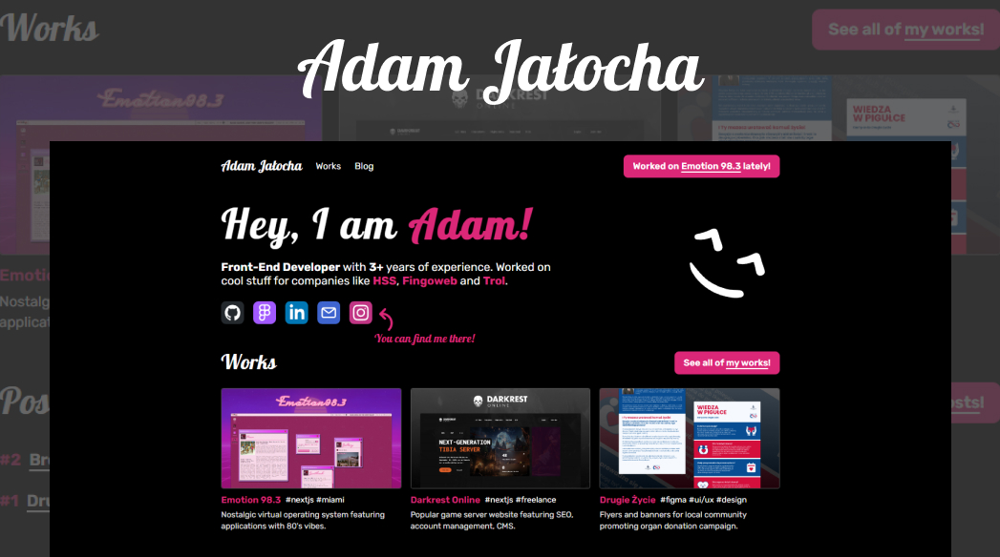

# Adam Jałocha portfolio

Welcome to my portfolio! This website showcases my projects, skills, and experience. Built with Astro, it highlights my work as a developer/designer and provides a glimpse into what I can do.

## 🌐 Live Demo

Check out the live demo of my portfolio [here](https://www.adamjalocha.pl/).

## 🛠️ Technologies Used

- **Astro**: Static site generator used to build the portfolio.
- **TypeScript**: Interactive elements and functionality.
- **TailwindCSS**: Styling and layout.
- **Markdown**: Easy content writing and management.
- **GitHub Pages**: Hosting the website.

## 📂 Included works

### *[Emotion.Miami](https://emotion.miami/)*: Nostalgic virtual operating system featuring applications with 80's vibes

### *[Darkrest.online](https://darkrest.online/)*: Popular game server website featuring SEO, account management, CMS

### *[Drugie Życie](https://www.adamjalocha.pl/works/drugie-zycie/)*: Flyers and banners for local community promoting organ donation campaign

### *[Harmonia](https://harmonia-orpin.vercel.app/)*: Your personalized gateway to the world of music

### *[React Flexible Datepicker](https://react-flexible-datepicker.vercel.app/)*: Customizable React Component

## 📞 Contact

Feel free to reach out to me via:

- Email: [jalochadev@gmail.com](mailto:jalochadev@gmail.com)
- LinkedIn: [linkedin.com/in/adam-jalocha](https://www.linkedin.com/in/adam-jalocha)
- Instagram: [@daysinek](https://www.instagram.com/daysinek/)

## Commands

All commands are run from the root of the project, from a terminal:

| Command                   | Action                                           |
| :------------------------ | :----------------------------------------------- |
| `npm install`             | Installs dependencies                            |
| `npm run dev`             | Starts local dev server at `localhost:4321`      |
| `npm run build`           | Build your production site to `./dist/`          |
| `npm run preview`         | Preview your build locally, before deploying     |
| `npm run astro ...`       | Run CLI commands like `astro add`, `astro check` |
| `npm run astro -- --help` | Get help using the Astro CLI                     |

---

Thank you for visiting my portfolio! If you like what you see, feel free to leave a star ⭐️ on the repository.

---